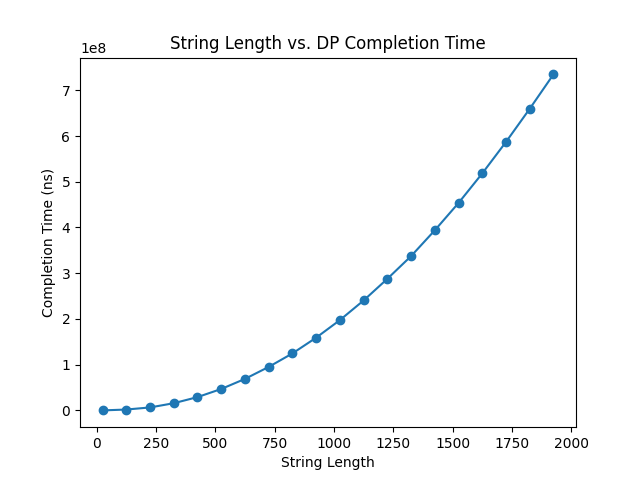
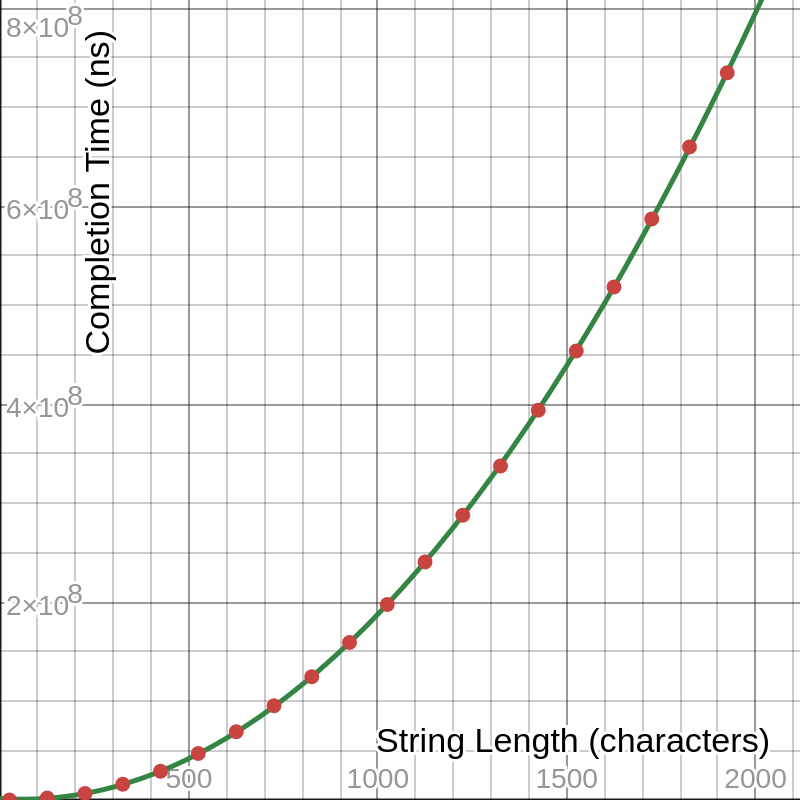
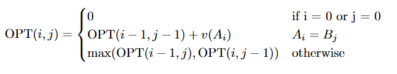

# COP 4533 Assignment 3

**Names:**  
Julian Dominguez (Seedname) - 80849534  
Alex Milanes (Alex42006) - 51506411  

## Usage

Running this program requires Python 3.14.

To run the program, use the command
```sh
python src/run.py
```  

Change the input file by updating the `file_name` variable on line `20`. Do not include the path to the file, nor the `.in` extension.  


To run the analyzer, use the command
```sh
python src/graph.py
```

This requires `matplotlib` and `tqdm`, which can be installed to your python environment with
```
pip install -r requirements.txt
```


### Input/Output

Define an input file in the `inputs/` directory. Input files must be in the format `[name].in`.  

Example input file `inputs/file1.in`:
```
3
a 2
b 4
c 5
aacb
caab
```

The first line contains the number of letters to be used in the alphabet, K.  
The next K lines contain each letter with its corresponding value, separated by a space.  
The last two lines contain the strings A and B, which are the inputs to the algorithm and must contain letters defined in the previous K lines.  

Output files contain the value of the highest value longest common subsequence on the first line, and the subsequence on the second line. For example, `outputs/file1.out`:

```
9
cb
```


## Written Component

### Question 1: Empirical Comparison

In `src/graph.py`, 20 string lengths (where `length(A) = length(B) = n`) ranging from 25 to 1925 characters, evenly spaced by 100 characters, with a constant alphabet size of 26 were analyzed for completion time with 10 samples each. This plot was generated with 200 input files that were randomly generated and not saved to the disk and is shown below.



This figure suggests a quadratic trend, and fitting it to a quadratic polynomial with regression yields the following curve, with an R<sup>2</sup> coefficient of approximately 1. This shows that the data is fit by a quadratic curve, which suggests that the average-case time complexity of the algorithm scales by n<sup>2</sup>.




### Question 2: Recurrence Equation

The recurrence equation used to calculate the dynamic programming solution is as follows:



OPT(i, j) is the value of the highest value longest common subsequence for the string prefixes A<sub>1</sub>A<sub>2</sub>...A<sub>i</sub> and B<sub>1</sub>B<sub>2</sub>...B<sub>j</sub>. I have defined our base case as when i or j is 0, as when one of the strings is empty, the HVLCS must have length 0 and therefore value 0. 

The first case describes when the current two characters being compared between A and B are equal. In this case, the best option is to take the current character and add its value to OPT(i-1, j-1), as this sum will always be greater than OPT(i-1, j) or OPT(i, j-1), since the values for the characters are nonnegative and taking a match will always be better or equal to skipping it.

The second case occurs when A<sub>i</sub> != B<sub>j</sub>. In this case, we do not have the option to take the current character's value, so we must choose between just the second two options: skipping A<sub>i</sub> or B<sub>j</sub>. We will again take the maximum of these two options.

The answer to the question can be found through accessing OPT(n, m), where n is the length of A and m is the length of B.

### Question 3: Big-Oh

The pseudocode for the function hvlcs that solves this problem is as follows:
```
hvlcs(K, v, A, B)
    n = length of A
    m = length of B

    for j = 0 to m
        M[0, j] = 0

    for i = 0 to n
        M[i, 0] = 0
    
    for i = 1 to n
        for j = 1 to m
            if Aᵢ = Bⱼ
                M[i, j] = M[i-1, j-1] + v(Aᵢ)
            else
                M[i, j] = max(M[i-1, j], M[i, j-1])
                
    return M[n, m]

```
This algorithm implements a bottom-up, tabulation approach to the above recurrence equation. The runtime of this algorithm is O(n*m) to fill out the dp table, where n is the length of string A and m is the length of string B. This matches the quadratic nature of the runtimes observed in question 1.